# ib-slurm-exporter

Correlate InfiniBand and RoCE counters with the Slurm job that owns them, so a
slow multi-node training run can be traced to the fabric instead of guessed at.

> **Status:** validated only against synthetic `/sys`, `/proc` and cgroup
> trees built from the kernel and Slurm documentation. It has **not** been run
> on InfiniBand hardware or on a Slurm 26.05 node. Every hardware- or
> Slurm-facing claim below says where it comes from.

```
make demo
```

No InfiniBand, no cluster, no Linux required. Builds a synthetic `/sys`,
`/proc` and cgroup tree and serves real metrics off it. Needs Go ≥ 1.26.3
(the `go` line in `go.mod`) and `make`; without `make`,
`go run ./cmd/ib-slurm-exporter --demo --once` prints the same metrics once.

---

## The problem

*Illustrative scenario — hypothetical numbers, not a measured incident:*

A 64-node training run drops from 4,200 to 900 samples/sec. The GPUs look busy.
Slurm says the job is `RUNNING`. Your Slurm exporter reports job count, state,
and runtime — none of which move.

The actual cause is one HCA retransmitting: `packet_seq_err` climbing on
`mlx5_1`, which stalls the all-reduce and idles every GPU behind it.

Your fabric monitoring can see that counter. What it usually cannot tell you is
which job on a shared compute node was using that HCA at the time. This
exporter does that on the compute node itself: **per-HCA (or, in `qp` mode,
per-port) attribution to the Slurm job with processes on it, with
shared-device suppression.**

## How the join works



<sub>Each hop is a lookup that can be wrong on its own. The fourth is the one that bites: `uverbs3` does not have to mean `mlx5_3`.</sub>

Neither Slurm nor the HCA knows about the other. By default the bridge is a
file descriptor:

```
Slurm cgroup                                /proc                     sysfs
─────────────                               ─────                     ─────
<job>/step_0/user/task_0/cgroup.procs
        │
        └─▶ PID 41001
                  │
                  └─▶ /proc/41001/fd/3 ──▶ /dev/infiniband/uverbs0
                                                      │
                    /sys/class/infiniband_verbs/uverbs0/ibdev ──▶ "mlx5_0"
                                                                      │
                        /sys/class/infiniband/mlx5_0/ports/1/hw_counters/
                                                                      │
                                                              packet_seq_err
```

A userspace process doing RDMA through libibverbs holds an open descriptor on
a uverbs device. That is the per-process link this exporter uses by default
(`--ownership=fd`). It has blind spots, listed in the next section; the
opt-in `--ownership=qp` mode closes some of them.

The last hop goes through sysfs deliberately. `uverbs3` does **not** have to
mean `mlx5_3` — the numbering is independent, and a host where they happen to
match is exactly the host where a shortcut looks correct and is wrong elsewhere.

## What can and cannot be attributed

**PMA port counters (bytes, packets, link errors) are per port.** The HCA
counts packets; these counters do not record which process sent them. So when
two jobs share `mlx5_1`, there is no way to split its `port_xmit_data` between
them.

**The mlx5 retry counters are different.** The Q counters
(`packet_seq_err`, `out_of_sequence`, `rnr_nak_retry_err`, …) can be bound to
a counter set per process or per QP through RDMA netlink counter binding —
for `rdma statistic qp set link mlx5_2/1 auto pid on`, rdma-statistic(8) says
"for each new user QP bind it with a counter automatically. Per counter for
QPs with same pid"
([rdma-statistic(8)](https://man7.org/linux/man-pages/man8/rdma-statistic.8.html);
`RDMA_COUNTER_MASK_PID` in
[`include/uapi/rdma/rdma_netlink.h`](https://github.com/torvalds/linux/blob/master/include/uapi/rdma/rdma_netlink.h)).
Caveats: auto mode binds QPs created after it is enabled, the man page does not
document the privileges it needs or how many counter sets an HCA offers, and
none of it has been tried on a ConnectX from this repository. **This exporter
does not use counter binding yet**; it is the next milestone, and it would turn
shared-device suppression into real per-job attribution for the retry signal.

Exporters that ignore sharing emit job-labelled series that are wrong in the
worst possible way: a noisy neighbour's retries land on a healthy job, so the
metric misleads you precisely when you are using it to debug an incident.

This exporter emits two families instead:

| Family | Labelled with a job? | When |
| --- | --- | --- |
| `ib_slurm_job_*` | yes | **Only** for a port on which the job is the only user the exporter can see |
| `ib_slurm_device_*` | no | Always. Ground truth. |

Plus `ib_slurm_device_jobs` and `ib_slurm_job_device_attributed`, so a
dashboard can show *why* attribution is missing rather than leaving a
mysterious gap.

### What "only user it can see" means

| | `--ownership=fd` (default) | `--ownership=qp` (opt-in) |
| --- | --- | --- |
| A user is | a Slurm job with a process holding an open uverbs fd on the HCA | the owner of a non-management QP on the port, from the kernel's RDMA resource tracking (`rdma -j resource show qp`) |
| Granularity | per HCA: a job is treated as using **every port** of it (an fd carries no port) | per port |
| Kernel RDMA users whose QPs go through ib_core (NFS/RDMA, Lustre o2ib, iSER, non-enhanced IPoIB) | **invisible** — their traffic can land on a job that looks sole | counted as non-job users; attribution suppressed |
| mlx5 enhanced IPoIB (QP created by mlx5_core, not listed) | invisible | every IPoIB interface on the port that is not down counts as a non-job user; attribution suppressed |
| Userspace QPs created through mlx5 DEVX (UCX's default on mlx5, see below) | the process holds a uverbs fd, so it counts as a user of the HCA | **invisible** — its traffic can land on a job that looks sole |
| Processes outside Slurm | invisible | counted as non-job users (unless their QPs are DEVX); attribution suppressed |
| NCCL opening every active HCA (UCX not checked) | every HCA looks shared on a multi-job node; in practice **per-job attribution needs node-exclusive jobs** | only ports with QPs count |
| Verified on hardware | no | no — key names and QP types are from iproute2's source; the IPoIB and DEVX behaviour from kernel and UCX source; nothing from a live run |

Kernel-owned QPs have no PID: `rdma_netlink.h` says of
`RDMA_NLDEV_ATTR_RES_PID`, "in case of kernel origin, PID won't exist". The
management QPs (types `SMI`/`GSI`) are created by the kernel, not by a job,
and are ignored.

**What `qp` mode cannot list.** Resource tracking only sees QPs created
through ib_core: `create_qp` in
[`drivers/infiniband/core/verbs.c`](https://github.com/torvalds/linux/blob/master/drivers/infiniband/core/verbs.c)
calls `rdma_restrack_add`. Two kinds of QP bypass it (read from upstream
source; not observed on hardware):

- **mlx5 enhanced IPoIB.** When the HCA advertises `ipoib_enhanced_offloads`,
  `ipoib_intf_init` takes its netdev from `rdma_init_netdev`
  ([`ulp/ipoib/ipoib_main.c`](https://github.com/torvalds/linux/blob/master/drivers/infiniband/ulp/ipoib/ipoib_main.c)),
  and mlx5_core creates the underlay QP with a raw `MLX5_CMD_OP_CREATE_QP`
  firmware command
  ([`mlx5/core/ipoib/ipoib.c`](https://github.com/torvalds/linux/blob/master/drivers/net/ethernet/mellanox/mlx5/core/ipoib/ipoib.c)).
  TCP over `ib0` (Gloo, NCCL's socket transport) or NFS over IPoIB then has
  no QP to list. The exporter therefore also counts IPoIB interfaces from
  sysfs: parents under `/sys/class/infiniband/<hca>/device/net/` (the
  interface's `dev_port` is the port minus 1, set in `ipoib_parent_init`),
  P_Key children in `/sys/class/net` through `iflink`, both with `type` 32
  (`ARPHRD_INFINIBAND`). An interface counts unless its `operstate` is
  `down` ("unable to transfer data on L1, f.e. ethernet is not plugged or
  interface is ADMIN down") or `lowerlayerdown` (stacked on a down
  interface), per
  [operstates.rst](https://docs.kernel.org/networking/operstates.html); an
  unreadable state counts. `/sys/class/net` is taken as the sibling of
  `--sys-root`. Whether a given ConnectX and firmware advertise the
  capability has not been checked. Non-enhanced IPoIB creates its QP through
  ib_core when the interface registers, so on those ports the kernel QP
  suppresses attribution even while the interface is down.
- **DEVX.** mlx5 lets userspace create QPs with firmware commands
  ([`hw/mlx5/devx.c`](https://github.com/torvalds/linux/blob/master/drivers/infiniband/hw/mlx5/devx.c)
  has no restrack call). UCX's IB memory-domain configuration defaults
  `MLX5_DEVX` to `try` and `MLX5_DEVX_OBJECTS` to
  `rcqp,rcsrq,dct,dcsrq,dci,cq`
  ([`src/uct/ib/base/ib_md.c`](https://github.com/openucx/ucx/blob/master/src/uct/ib/base/ib_md.c)),
  so a UCX job on mlx5 may have no QP in the listing at all: it is not
  counted as a user, and its traffic can be charged to another job that
  looks sole. **This is not detected and is the known fail-open case of `qp`
  mode.** Whether DEVX succeeds on a particular HCA, firmware and kernel was
  not checked. Where UCX (or anything else using DEVX) shares nodes, use `fd`
  mode, which sees the process's uverbs descriptor.
NCCL's `net_ib` transport opens each device returned by
`ibv_get_device_list`, keeps the context, and closes it again only when it
found no usable port (`nPorts == 0` in
[`src/transport/net_ib/init.cc`](https://github.com/NVIDIA/nccl/blob/master/src/transport/net_ib/init.cc)).

### Job counters are accumulated, not copied

`ib_slurm_job_counter_total` is **not** the port's lifetime counter. It starts
at 0 when the job is first seen as the port's sole user and adds only the
increase between two consecutive samples in which the job was sole user.
Samples are taken on every scrape and every `--sample-interval` (15 s by
default). So:

- a neighbour's traffic during a shared period never lands in the job's series,
  even across the gap when attribution comes back;
- a new job does not inherit earlier jobs' errors;
- a decrease (the subnet manager clearing a PMA counter, or a 32-bit wrap) is
  treated as a reset, like `rate()` does. Whatever the port counted between
  the previous sample and the clear or wrap is lost, so it can under-count,
  but it never over-counts;
- a cgroup scan that fails is not taken as a job ending: job series and
  cached SLUIDs are dropped only when a clean scan no longer finds the job,
  or after it has been missing for 10 minutes (so a scan error that never
  clears cannot keep state for ended jobs forever).

The blind spot that remains: a neighbour that starts and finishes entirely
between two samples cannot be seen.

### Failing safe

Anything that leaves the user set incomplete suppresses **all** job
attribution for that sample and is reported, because an incomplete user set
can make a shared port look exclusive:

| Condition | Reported as |
| --- | --- |
| `/proc/<pid>/fd` unreadable (missing `CAP_DAC_READ_SEARCH` or `CAP_SYS_PTRACE`, see Privileges) | `ib_slurm_pid_fd_unreadable`, `ib_slurm_scrape_error{source="procfd"}` |
| PID listed in a job's cgroup but missing from `/proc` (hidepid, wrong PID namespace) | same |
| uverbs fd whose `ibdev` cannot be resolved | same |
| part of the cgroup tree unreadable (a job's subtree, a job or `uid_*` directory, the scope) | `ib_slurm_scrape_error{source="cgroup"}` |
| QP listing or IPoIB interface scan failed (`qp` mode) | `ib_slurm_scrape_error{source="rdma"}` |
| a SLUID that cannot be resolved | `ib_slurm_unresolved_sluid_allocations`; the allocation still counts as a device user |

One gap is not detected: DEVX QPs in `qp` mode (see above).

Suppressing attribution never loses data. In the demo, `mlx5_1` is shared by
two jobs and its retry counters (48,221 `packet_seq_err` in the synthetic
fixture, and climbing) are still exported — just at device level, where they
are true.

HCA counters are endpoint symptoms: `packet_seq_err` on a node's HCA says
something on the path is dropping or reordering, not which link. Finding the
faulty cable or switch port needs switch-side counters (UFM,
`ibqueryerrors`, a fabric exporter — see Related work).

## Slurm 26.05 changed the cgroup layout

From the Slurm 26.05 CHANGELOG
([`CHANGELOG/slurm-26.05.md`](https://github.com/SchedMD/slurm/blob/slurm-26.05/CHANGELOG/slurm-26.05.md)):

> Slurm cgroup/v2 paths are now constructed using the SLUID instead of the
> numeric job id.

and from [`cgroup.conf(5)`](https://slurm.schedmd.com/cgroup.conf.html),
`CgroupJobIdPaths` (default `no`):

> If configured to "yes" then job-level cgroup directories are named with the
> numeric job ID instead of with the SLUID (e.g.
> "/sys/fs/cgroup/system.slice/slurmstepd.scope/job_123/" instead of
> "/sys/fs/cgroup/system.slice/slurmstepd.scope/sEKNKTV3WPV500/").

So on a default 26.05 node the job directory is the **bare SLUID, with no
`job_` prefix**. Version 0.1.0 of this exporter assumed `job_<SLUID>` and found
**no jobs at all** on such a node; that is fixed in the Unreleased changes (see
[CHANGELOG.md](CHANGELOG.md)). Three layouts are handled:

| Layout | Job directory |
| --- | --- |
| cgroup v1 | `<root>/<ctrl>/slurm/uid_<uid>/job_<jobid>/step_<n>/` |
| cgroup v2 before 26.05, or 26.05 with `CgroupJobIdPaths=yes` | `<scope>/job_<jobid>/step_<n>/user/task_<t>/` |
| cgroup v2, 26.05 default | `<scope>/<SLUID>/step_<n>/user/task_<t>/`, e.g. `sEKNKTV3WPV500` |

`<scope>` is `system.slice/slurmstepd.scope` by default. It moves with
`CgroupSlice` (cgroup.conf), and `--enable-multiple-slurmd` builds prepend the
node name to it ([cgroup_v2.html](https://slurm.schedmd.com/cgroup_v2.html)),
so the exporter discovers `<root>/*.slice/*slurmstepd.scope` and
`<root>/*.slice/*.slice/*slurmstepd.scope`; anything deeper (slurmd in a
container) needs `--slurm-scope`. A SLUID directory is recognised by having
`step_*` children; the scope's `system/` directory holds slurmstepd's infinity
process and is never a job. PIDs are collected from every leaf cgroup, because
processes live in `step_<n>/user/task_<t>`, not at the job level.

A SLUID does not contain the job ID, so it is resolved, in order:

1. from a cache — a SLUID's job ID never changes ("This value remains constant
   during the lifetime of the job", squeue(1) `Sluid`), so an entry lives until
   the SLUID's directory disappears;
2. locally, from the process title of the job's slurmstepd in
   `step_<n>/slurm/cgroup.procs`, which reads `slurmstepd: [<jobid>.<step>]` in
   the example tree on cgroup_v2.html;
3. from the background squeue cache (`--Format=…,Sluid`).

If 2 and 3 disagree the SLUID stays unresolved. Anything unresolved is
**counted in `ib_slurm_unresolved_sluid_allocations`, never guessed at**, and
still counts as a device user so it cannot make a neighbour look sole. A metric
on the wrong job is worse than a metric on no job.

> The 26.05 handling is implemented from the documentation cited above and
> tested against synthetic trees shaped like it. It has **not** been validated
> on a live 26.05 node. If you run one, the output of
> `find /sys/fs/cgroup -maxdepth 6 -type d -path '*slurmstepd.scope*'` and one
> `cat /proc/<slurmstepd pid>/cmdline | tr '\0' ' '` would let the synthetic
> fixture be replaced with a real one.

## Metrics

| Metric | Type | Labels | Meaning |
| --- | --- | --- | --- |
| `ib_slurm_job_counter_total` | counter | `job_id`, `user`, `account`, `partition`, `device`, `port`, `counter` | increase seen while the job was the port's sole user (see above); same units as the device counter |
| `ib_slurm_job_device_attributed` | gauge | `job_id`, `device`, `port` | 1 attributed, 0 the job uses the port but attribution is suppressed |
| `ib_slurm_job_info` | gauge | `job_id`, `user`, `account`, `partition` | always 1; squeue metadata for `group_left` joins |
| `ib_slurm_job_processes` | gauge | `job_id`, `user`, `account`, `partition` | processes in the job's cgroup (including its slurmstepds) |
| `ib_slurm_device_counter_total` | counter | `device`, `port`, `counter` | raw counter; units below |
| `ib_slurm_device_counter_saturated` | gauge | `device`, `port`, `counter` | 1 when a fixed-width PMA counter is at 2^width−1 |
| `ib_slurm_device_jobs` | gauge | `device`, `port` | jobs using the port (incl. unresolved SLUIDs); a real 0 on idle ports |
| `ib_slurm_device_nonjob_users` | gauge | `device`, `port` | `qp` mode only: kernel or non-Slurm QPs on the port, plus IPoIB interfaces on it that are not down (a non-enhanced IPoIB interface can count twice: its QP and itself) |
| `ib_slurm_device_port_up` | gauge | `device`, `port`, `link_layer`, `rate` | 1 when ACTIVE |
| `ib_slurm_unattributed_jobs` | gauge | — | jobs using RDMA (or with unreadable evidence) attributed on no port |
| `ib_slurm_unresolved_sluid_allocations` | gauge | — | SLUID cgroups not mapped to a job |
| `ib_slurm_pid_fd_unreadable` | gauge | — | `fd` mode: job PIDs whose fds could not be read |
| `ib_slurm_cgroup_layout_info` | gauge | `layout`, `scope` | always 1; `cgroup-v1`, `cgroup-v2`, `cgroup-v2-sluid` or `unknown` |
| `ib_slurm_cgroup_scope_found` | gauge | — | 1 when a Slurm cgroup root exists, even with no jobs |
| `ib_slurm_scrape_error` | gauge | `source` | 1 when `sysfs`, `cgroup`, `procfd` or `rdma` (`qp` mode: QP listing or IPoIB scan) failed on the last sample |
| `ib_slurm_metadata_last_success_timestamp_seconds` | gauge | — | last good squeue refresh; 0 if none |
| `ib_slurm_metadata_refresh_errors_total` | counter | — | failed squeue refreshes |
| `ib_slurm_metadata_jobs` | gauge | — | jobs in the squeue cache |

`layout=cgroup-v2-sluid` is only reported once at least one SLUID-named job
directory exists; an idle 26.05 node reports `cgroup-v2` with
`scope_found=1`. promlint objects to the word "counter" in the two
`*_counter_total` names; renaming them (and splitting the mixed-unit `counter`
label into typed families) is deferred to before 1.0 because it breaks every
existing query.

### Counters collected, with units and widths

**PMA port counters** (`ports/<n>/counters/`). Widths are from `PORT_PMA_ATTR`
in
[`drivers/infiniband/core/sysfs.c`](https://github.com/torvalds/linux/blob/master/drivers/infiniband/core/sysfs.c):

| Counter | Unit | Width |
| --- | --- | --- |
| `port_xmit_data`, `port_rcv_data` | **4-octet words** — "Total number of data octets, divided by 4 (lanes)" ([ABI doc](https://github.com/torvalds/linux/blob/master/Documentation/ABI/stable/sysfs-class-infiniband)); multiply by 4 for bytes | 32, or 64 on HCAs with extended counters |
| `port_xmit_packets`, `port_rcv_packets` | packets | 32 or 64 |
| `port_xmit_wait` | ticks with data queued but nothing sent | 32 |
| `symbol_error`, `port_rcv_errors`, `port_xmit_discards`, `port_rcv_remote_physical_errors`, `port_rcv_switch_relay_errors`, `VL15_dropped` | events | 16 |
| `link_downed`, `link_error_recovery` | events | 8 |
| `local_link_integrity_errors`, `excessive_buffer_overrun_errors` | events | 4 |

A narrow error counter tops out quickly: `link_downed` at 255,
`local_link_integrity_errors` at 15. If the HCA holds it there (OpenSM's
perfmgr clears counters well before the maximum for this reason; the IBTA
spec text itself was not checked), `rate()` reads 0 from then on and an alert
on it silently stops firing. `ib_slurm_device_counter_saturated` flags that
state; let the subnet manager's perfmgr or UFM clear the counters.
[prometheus/procfs](https://github.com/prometheus/procfs/blob/master/sysfs/class_infiniband.go),
which node_exporter's InfiniBand collector reads through, multiplies the data
counters by 4; this exporter exports the raw sysfs value and says so in HELP.

**mlx5 hardware counters** (`ports/<n>/hw_counters/`), every name taken from
[`drivers/infiniband/hw/mlx5/counters.c`](https://github.com/torvalds/linux/blob/master/drivers/infiniband/hw/mlx5/counters.c):

- Q counters, read as 32-bit values (`be32_to_cpu`), so they wrap and
  `rate()` under-counts slightly at each wrap: `packet_seq_err`,
  `out_of_sequence`, `out_of_buffer`, `rnr_nak_retry_err`,
  `local_ack_timeout_err`, `implied_nak_seq_err`, `duplicate_request`,
  `req_cqe_error`, `resp_cqe_error`, `req_remote_access_errors`,
  `resp_remote_access_errors`, `req_transport_retries_exceeded`,
  `roce_adp_retrans`.
- RoCE congestion: `np_cnp_sent`, `rp_cnp_handled`, `rp_cnp_ignored`,
  `np_ecn_marked_roce_packets`.

**Not collected: RoCE pause (PFC) counters.** mlx5 does not expose them as
RDMA `hw_counters`; they are netdev counters (`rx_pause_ctrl_phy`,
`rx_prio<p>_pause`, …) per the
[mlx5 ethtool counters doc](https://docs.kernel.org/networking/device_drivers/ethernet/mellanox/mlx5/counters.html).
Version 0.1.0 listed `rx_pause`/`tx_pause` and would never have found them on
real hardware. Reading them needs a separate netdev reader.

Counters the kernel does not expose are **absent**, not zero. A counter this
firmware lacks and a counter that is genuinely zero are different facts.

### Queries worth alerting on

Thresholds are examples, not recommendations derived from data.

```promql
# Retries on a job's own port (only where the job is sole user)
rate(ib_slurm_job_counter_total{counter="packet_seq_err"}[5m]) > 100

# The same at device level, whoever is on the port
rate(ib_slurm_device_counter_total{counter="packet_seq_err"}[5m]) > 100

# rate() is blind on these until they are cleared
ib_slurm_device_counter_saturated == 1

# Attribution is degraded on a node
ib_slurm_scrape_error == 1 or ib_slurm_pid_fd_unreadable > 0

# Job labels are stale
time() - ib_slurm_metadata_last_success_timestamp_seconds > 600

# Bytes per second (the data counters are in 4-octet units)
rate(ib_slurm_device_counter_total{counter="port_xmit_data"}[5m]) * 4
```

### Dashboard

A Grafana dashboard is in
[`deploy/grafana-dashboard.json`](deploy/grafana-dashboard.json) — attribution
health first, then per-job errors, throughput, and device-level state, in the
order you debug a slow multi-node job. It has a `$node` variable, and every
per-series panel aggregates `by (instance, …)`, so the failing node is
identifiable; the six attribution-health stats at the top are totals across
the selected nodes (narrow `$node` to find the node). A test
(`TestDashboardQueriesMatchTheExporter`) checks metric names, label names in
selectors, `by()` clauses, `label_values()` and legends, and counter names
against the source, and rejects an aggregation without `by (instance, …)`
outside a stat panel. The dashboard has **not** yet been imported into a live
Grafana and Prometheus.

## Deployment

One instance per compute node — a systemd unit or a DaemonSet. Every sample
reads local sysfs, `/proc` and cgroups; job metadata comes from a background
`squeue --nodelist=localhost` call, refreshed every `--squeue-interval` ±20%
and never on the scrape path.

```bash
ib-slurm-exporter --listen 10.0.0.12:9836   # bind to the management network
ib-slurm-exporter --once                    # print ib_slurm_* once (text format) and exit
ib-slurm-exporter --demo                    # synthetic node, no hardware
```

`--once` prints only the `ib_slurm_*` families, with `# HELP`/`# TYPE`, and
logs to stderr, so its output can go straight into node_exporter's textfile
directory. (Job counters start at 0, so a single `--once` sample reports 0
for them; the demo takes a baseline and advances its synthetic counters once
before printing.)

| Flag | Default | |
| --- | --- | --- |
| `--listen` | `:9836` | See Security |
| `--sys-root`, `--verbs-root`, `--proc-root`, `--cgroup-root` | `/sys/class/infiniband`, `/sys/class/infiniband_verbs`, `/proc`, `/sys/fs/cgroup` | Injectable for tests and containers; `qp` mode reads IPoIB interfaces from the `net/` directory next to `--sys-root` |
| `--slurm-scope` | discover | slurmstepd scope relative to `--cgroup-root` |
| `--ownership` | `fd` | `fd` or `qp` (see above) |
| `--rdma-path` | `/usr/sbin/rdma` | iproute2 `rdma`, `qp` mode only |
| `--squeue-path` | `/usr/bin/squeue` | absolute; empty disables squeue entirely |
| `--squeue-nodelist` | `localhost` | "A node_name of localhost is mapped to the current host name" (squeue(1)); set the Slurm NodeName if it differs |
| `--squeue-interval` | `60s` | mean refresh interval, ±20% jitter; at least `10s` (smaller values, including `0`, are refused: every node runs one; to switch squeue off use `--squeue-path=`) |
| `--sample-interval` | `15s` | background sampling for job accumulators; `0` = on scrape only |
| `--no-user-labels` | off | empty `user`/`account`/`partition`, no `ib_slurm_job_info` |
| `--web.max-requests` | `2` | concurrent `/metrics` requests; more get 503 |

**Privileges.** Reading other users' `/proc/<pid>/fd` needs root, or **both**
`CAP_DAC_READ_SEARCH` and `CAP_SYS_PTRACE`. The directory is created as
`DIR("fd", S_IRUSR|S_IXUSR, …)`, mode 0500 owned by the process's user
([`fs/proc/base.c`](https://github.com/torvalds/linux/blob/master/fs/proc/base.c)),
and `proc_fd_permission`
([`fs/proc/fd.c`](https://github.com/torvalds/linux/blob/master/fs/proc/fd.c))
checks only `generic_permission`, which lets `CAP_DAC_READ_SEARCH` list it;
reading each link goes through `call_proc_get_link`, which requires
`ptrace_may_access`, i.e. `CAP_SYS_PTRACE`. This is read from the kernel
source; it has not been tested on a live kernel from this repository.
Without them, `ib_slurm_pid_fd_unreadable` and
`ib_slurm_scrape_error{source="procfd"}` go to non-zero, every job using RDMA
lands in `ib_slurm_unattributed_jobs`, and no job series are emitted — the
failure is visible, and tested (`TestProcPermissionDeniedFailsSafeAndIsVisible`).
With `/proc` mounted `hidepid=1/2` (or systemd `ProtectProc=invisible`), job
processes the exporter cannot see are treated the same way rather than as
exited. Whether these capabilities see through hidepid on your kernel has not
been verified here. In a container, run in the host PID namespace.

**squeue.** squeue(1) warns: "Do not run squeue or other Slurm client commands
that send remote procedure calls to slurmctld from loops in shell scripts or
other programs." One exporter per node is such a loop, so the call is scoped
to this node, infrequent, jittered so a rollout does not line nodes up, and
optional (`--squeue-path=`). Whether slurmctld filters by node server-side —
i.e. whether `--nodelist` reduces controller work and not just output — has not
been verified. The interval cannot go below 10 s. Failures keep the previous
cache, count in `ib_slurm_metadata_refresh_errors_total`, and are logged at
most every ten minutes. The `Sluid` field is new in 26.05; per the slurm-25.05
source, an older squeue does not fail on it but logs "Invalid job format
specification" and prints an empty column (`parse_long_format` in
[`src/squeue/opts.c`](https://github.com/SchedMD/slurm/blob/slurm-25.05/src/squeue/opts.c)),
so metadata still loads and no SLUID is mapped, and none needs to be, since
older Slurm does not name cgroups by SLUID. If a squeue does exit non-zero
with an error naming the field, the exporter falls back to the old format,
retries `Sluid` hourly, and resolves SLUIDs from slurmstepd titles only in the
meantime. Any other failure of the `Sluid` query (a controller timeout, say)
is an ordinary failed refresh: counted, logged, the previous cache kept, and
`Sluid` asked for again next time. All of this is tested against stand-ins,
not a real squeue of any version.

**Security.** `/metrics` has no authentication or TLS, and job series carry
`user`, `account` and `partition`: anyone who can reach the port can list who
runs what. Bind `--listen` to a management interface, firewall it, or use
`--no-user-labels`. The exporter runs `squeue` and `rdma` by absolute path only
(it refuses relative paths), and bounds concurrent scrapes. TLS and basic auth
(e.g. via `prometheus/exporter-toolkit`) are not built in, to keep the
dependency surface to `client_golang`; for now use a reverse proxy or network
policy.

**Port.** 9836 is also listed for the "JetBrains Floating License Server
Exporter" on the Prometheus
[default port allocations](https://github.com/prometheus/prometheus/wiki/Default-port-allocations)
wiki, and 9835 for utkuozdemir's nvidia_gpu_exporter, which is often deployed
alongside. A dedicated port has not been requested yet.

**Packaging** — none of these has been run on a real host or cluster:

- [`deploy/systemd/ib-slurm-exporter.service`](deploy/systemd/ib-slurm-exporter.service):
  non-root user with `AmbientCapabilities=CAP_SYS_PTRACE CAP_DAC_READ_SEARCH`
  (both needed, see Privileges), `ProtectSystem=strict` and friends; the file
  explains the settings it deliberately leaves out.
- [`deploy/kubernetes/daemonset.yaml`](deploy/kubernetes/daemonset.yaml):
  `hostPID`, read-only `/sys`, all capabilities dropped except `SYS_PTRACE`
  and `DAC_READ_SEARCH`. Checked for YAML syntax only.
- [`Dockerfile`](Dockerfile): static binary on distroless, not published.
  CI is configured to build it and run `--demo --once` inside it (the `image`
  job in `.github/workflows/ci.yml`), but that job has not run yet, so the
  image has never been built.
- `.github/workflows/release.yml` attaches static linux/amd64 and arm64
  binaries to a GitHub release on a `v*` tag. It has not run yet.

**Running alongside Slinky** (slurmd in Kubernetes pods): unverified. The
cgroup path of a pod's `slurmstepd.scope` on the host is unknown to this
repository, so set `--slurm-scope` after finding it on a node; the exporter
must see host PIDs (`hostPID: true`) because `cgroup.procs` lists them; and
without squeue in the image, series carry job IDs only.

## Related work and how this differs

Each line cites what the project itself documents.

- **node_exporter's `infiniband` collector** — "Exposes network statistics
  specific to InfiniBand and Intel OmniPath configurations"
  ([node_exporter](https://github.com/prometheus/node_exporter)). Device level,
  no jobs.
- **[guilbaults/infiniband-exporter](https://github.com/guilbaults/infiniband-exporter)**
  — "installed on one server connected to the fabric, it will collect all the
  ports statistics on all the switches". Switch side, the right tool for
  finding the faulty link; no jobs.
- **[guilbaults/slurm-job-exporter](https://github.com/guilbaults/slurm-job-exporter)**
  — "stats in the cgroup accounting with Slurm", plus NVIDIA GPU stats. Per job,
  but its README does not describe fabric counters.
- **NVIDIA UFM's SLURM integration** — the current UFM Enterprise manual
  ([UFM-SLURM Integration](https://networking-docs.nvidia.com/ufmenterpriseum/6251/ufm-slurm-integration))
  describes assigning partition keys and SHARP reservations to a job's nodes
  from prolog/epilog scripts. An older manual version (v6.16.0) was cited in an
  audit of this repo as monitoring job nodes' bandwidth, congestion and errors;
  that page now redirects to a 404 and could not be re-checked.
- **LDMS `ibnet` sampler** — fabric counter collection for production HPC
  systems ([LDMS Monitoring of EDR InfiniBand Networks](https://www.osti.gov/servlets/purl/1814419)).

What this exporter adds is narrower than "connecting jobs to the fabric":
per-process attribution on the compute node itself, per HCA (`fd`) or per
port (`qp`), that refuses to attribute a shared port. Pair it with a
switch-side exporter to localise the link.

## Limitations

- **Shared ports are never job-attributed.** By design; see above.
- **`fd` mode cannot see kernel RDMA users or non-Slurm processes**, attributes
  per HCA rather than per port, and on shared nodes effectively needs
  node-exclusive jobs because NCCL opens every active HCA. `qp` mode addresses
  these but is unverified on hardware.
- **`qp` mode cannot see DEVX QPs** (UCX's default on mlx5), so a UCX job can
  go uncounted and its traffic land on a job that looks sole; this is not
  detected. It sees mlx5 enhanced IPoIB only as interfaces, so an IPoIB
  interface that is up suppresses attribution on its port whether or not it
  carries traffic.
- **No per-QP / per-PID counter binding yet.** See "What can and cannot be
  attributed".
- **mlx5-centric.** The hardware counter names are Mellanox/NVIDIA. Other
  vendors expose different `hw_counters`; PMA port counters are standard.
- **Slurm 26.05 support is unvalidated** on a live node, and SLUID resolution
  from slurmstepd titles relies on the title format shown in the Slurm docs.
- **Narrow PMA counters saturate** and the mlx5 Q counters wrap at 32 bits;
  the first is flagged, the second under-counts slightly at each wrap.
- **Sub-sample sharing is invisible** to the job accumulators.
- **Never run on InfiniBand hardware.** Everything above is tested against
  synthetic trees.

## Development

```bash
make test         # go test -race -cover, against synthetic trees
make lint         # gofmt check + go mod tidy check + vet + test
make demo         # serve the synthetic node on :9836
make demo-once    # print the exposition once
make demo-layouts # the three cgroup layouts side by side
make demo-check   # assert the demo's documented output (what CI runs)
```

Every root — sysfs, proc, verbs, cgroup — is injectable. That is what makes a
Linux-only exporter testable on a laptop, and it is why `make demo` works
without an HCA. The fixtures are synthetic and say so; golden trees captured
from a real ConnectX node and a real 26.05 node would be the next step up.

## The set

Part of a set of tools covering the lifecycle of a GPU allocation, each built on
the same rule — never act on absent evidence:

- **ib-slurm-exporter** — this repo. Fabric problems attributed to the job.
- **[gpu-reaper](https://github.com/Zhanyl-tech/gpu-reaper)** — wasted GPUs during a job.
- **[epilog-gpu-validator](https://github.com/Zhanyl-tech/epilog-gpu-validator)** — GPU hardware faults between jobs.
- **[slurm-scheduler-lab](https://github.com/Zhanyl-tech/slurm-scheduler-lab)** — the scheduling policy behind it all.

## License

MIT
